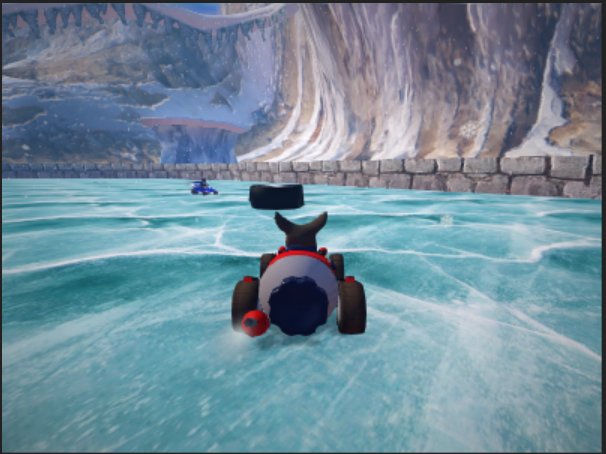
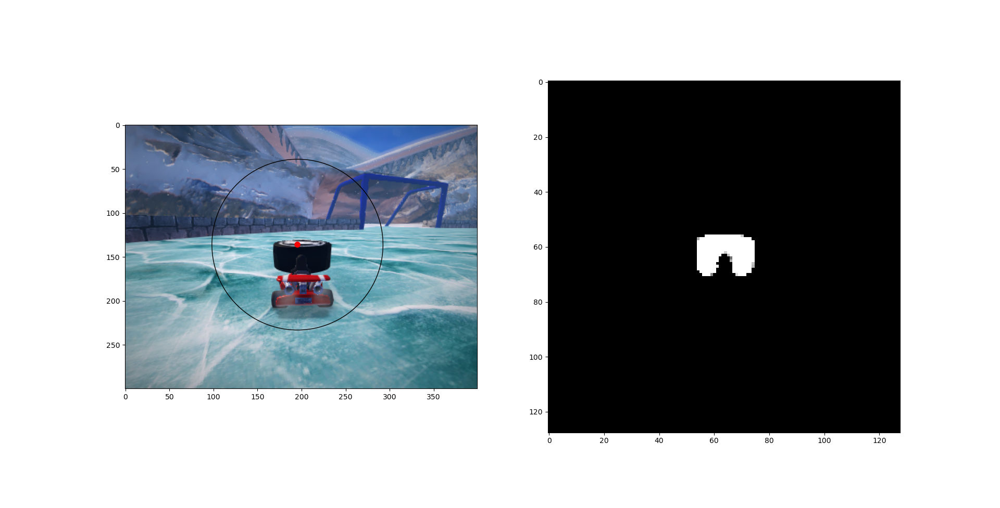
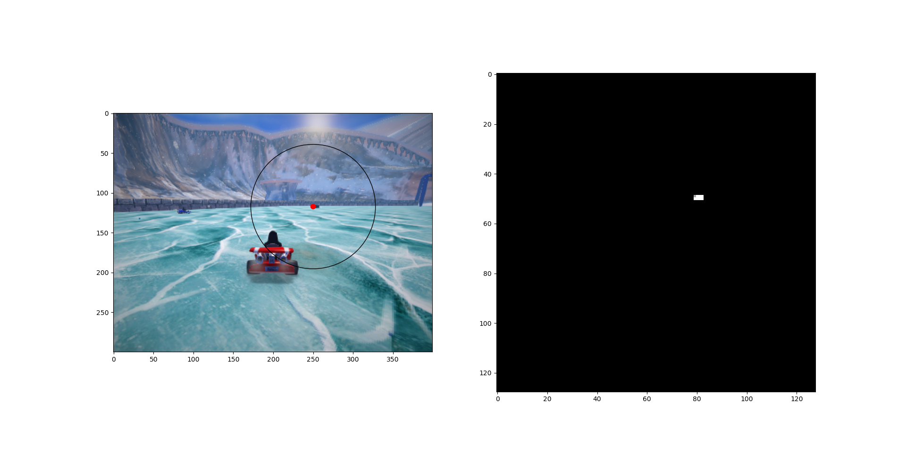

# Final project writeup

Explain your strategy here. Limit yourself to two pages, either markdown or pdf.

**Data Collection**

We first implemented a basic controller in order to collect data. We collected 8 episodes of 1,000 frames. 
For each episode we recorded the images from the 4 players,. Thus, our dataset contained 32,000 images.

We used this dataset to implement a better controller that uses the predicted puck controller. 
We then collected another set of 32,000 images using this controller and tuned our model on this dataset. 
This would mean we used only 1 iteration of dagger. Since the model already did sufficiently well, we focussed the rest of our 
efforts in the controller.

**Network & Loss Function**

For our HockeyPlayer's Puck Detector we took a segmentation approach. Our fully convolutional
network (from hw4's architecture) takes an image as input and predicts a binary mask for the puck
through extract_peak. It is trained with BCEWithLogitsLoss--appropriate for a binary classification--
and we make use of the focal loss, as in Homework 4. The result of the network can be seen below. During 
training we filtered out karts that yielded poor images, i.e. gnu. A lot of work was spent (and undone)
tuning the hyperparameters for training [e.g. weighing the losses]. 

  
Input Image into Network

  
The Network Yields A Mask of the Puck

The network we obtained performed better than expected on the data. As you can see in the following image, it can even discern between the black
shape of the player and the black shape of the puck.
  

**Controller**

The first thing the controller does is predicting the puck position from the image. For this, it uses the model mentioned above and the extract_peak 
function. It gets a list of 15 peaks max and averages them in order to get a more stable prediction.

We chose to use Wilbert as our kart since it is a fast kart which gave good results.

We tried a number of techniques for the HockeyPlayer, including adding team positions for
each member of the hockey team, a forward player who charges at the puck and a second player who
hangs back. We also track the distance the player is from their own goal and their opponent's goal
and adjust the aimpoint with an angle of both the player's and the opponent's goal. The importance of the angle to the opponent's goal 
depends on the distance to that goal (the higher the distance, the less importance it has).

The acceleration of the player is adjusted in order to maintain a constant velocity.

There were some techniques that we didn't end up implementing.
One of us tried improving rescue by keeping track of the player's 
previous velocities but this was not fruitful.

We also tried predicting the width in order to use it for the steer. The bigger the puck, the closer we are from it, and, if the puck is in front of us, 
the closer to the puck the lower the steer value would be in order to "dribble" the puck. However, our model did not perform well on this task as 
it can be seen in the following image (the circle is the width of the puck):
  

We could have predicted the width from the predicted mask directly by summing over the columns and taking the max. However, we ended up not pursuing this task.

As for the policy to take when the puck was not in sight, we implemented the following steps:
- Use the last prediction for a few steps
- If the last prediction is too old, start going backwards towards our own goal.
- When we see the puck again, continue going backwards for a few steps and then continue normally.

We tried implementing a policy in the controller to make the steer or the puck position depend on its last value (current_value * alpha + (1 - alpha) * new_value). 
However, this did not work well. We ended up using a simpler version of this which ignores a prediction if it is too different from the last prediction (it has a 
1 step cooldown).

Here is a video from a game recorded from the local grader (as mentioned below, it does not perform the same in the canvas grader, but it works for demonstration 
purposes). It's a link to a Google Drive video:

https://drive.google.com/file/d/1h6mueJzJTD_XqUBphpw07w58XzAwCpkq/view?usp=sharing

**Problems**

The main problem we experienced was a disparity between the local grader and the canvas grader. We first tuned the model in our local grader, which came 
with the starter code, but we ended up having to tune it again in the canvas grader. This disparity was significant to a point that a model that performed well 
in the local grader, performed badly in canvas. Also, the canvas grader had higher variance than the local grader.

Despite this, we ended up being able to obtain a model which scored in 37 out of 38 games in the canvas autograder (19 in each team). It averaged approximately 
2 goals per game, with a maximum of 3 goals.
